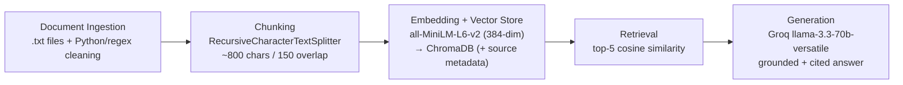

# Project 1 Planning: The Unofficial Guide

> Write this document before you write any pipeline code.
> Your spec and architecture diagram are what you'll use to direct AI tools (Claude, Copilot, etc.) to generate your implementation — the more specific they are, the more useful the generated code will be.
> Update the Retrieval Approach and Chunking Strategy sections if you change your approach during implementation.
> Update this file before starting any stretch features.

---

## Domain

<!-- What domain did you choose? Why is this knowledge valuable and hard to find through official channels? -->

My domain is the Official UniFi Home Networking and Troubleshooting Guide. It will help in purchasing the right Ubiquiti gear, configuring it (VLANs, PoE, etc.), and fixing it when the firmware updates break things.

Ubiquiti's unofficial docs tell what a device is, but not which model actually fits a real home, which firmware versions are stable for most people, or how to segment IoT devices safely. We can find this knowledge from forum threads and reddit from people who have encountered these problems.

## Documents

<!-- List your specific sources: URLs, subreddit names, forum threads, or file descriptions.
     Aim for at least 10 sources that together cover different subtopics or perspectives within your domain. -->

| #   | Source                | Description                                                     | URL or location                                                                                                                                                             |
| --- | --------------------- | --------------------------------------------------------------- | --------------------------------------------------------------------------------------------------------------------------------------------------------------------------- |
| 1   | Unifi forum           | Should I skip the U6 and purchase a U7                          | https://community.ui.com/questions/Should-I-skip-the-U6-and-purchase-a-U7/c1dda185-c2a0-447b-b3e3-215344d44b2c                                                              |
| 2   | Unifi forum           | Dream Router vs Cloud Gateway Ultra and U6+                     | https://community.ui.com/questions/Dream-Router-vs-Cloud-Gateway-Ultra-and-U6/0914f6b2-05e8-4e1f-8eef-5583683fed3b                                                          |
| 3   | Unifi forum           | UDM Pro vs. Cloud Gateway Ultra                                 | https://community.ui.com/questions/UDM-Pro-vs-Cloud-Gateway-Ultra/a590a25b-c3b9-498b-b399-8cf7669404af                                                                      |
| 4   | Unifi forum           | Cloud Gateway Ultra vs Dream Machine vs Gateway Max             | https://community.ui.com/questions/Cloud-Gateway-Ultra-vs-Dream-Machine-vs-Gateway-Max/931df9fa-560d-49e0-aba0-af21c75e09ed                                                 |
| 5   | Unifi forum           | Creating a separate IOT network - looking for best practice     | https://community.ui.com/questions/Creating-a-separate-IOT-network-looking-for-best-practice/137ef556-e12b-4270-88e0-a5b01bab9b3f                                           |
| 6   | Unifi forum           | Attempting to make THE UniFi IoT VLAN Walk-through              | https://community.ui.com/questions/Attempting-to-make-THE-UniFi-IoT-VLAN-Walk-through/d7658f5c-e1ba-4a07-8fed-1fea240bd2fd                                                  |
| 7   | Lazy Admin            | How to Setup and Secure UniFi VLAN                              | https://lazyadmin.nl/home-network/unifi-vlan-configuration/                                                                                                                 |
| 8   | The Smart Home Hookup | Setting Up VLANs and Firewall Rules                             | https://www.thesmarthomehookup.com/unifi-setup-from-scratch-setting-up-vlans-and-firewall-rules/                                                                            |
| 9   | Unifi forum           | How much power from POE do my Access Points really need?        | https://community.ui.com/questions/How-much-power-from-POE-do-my-Access-Points-really-need/71927a12-661e-41fc-b859-32f37984cd77                                             |
| 10  | Unifi forum           | U7 Pro Power and POE/POE+ switch port                           | https://community.ui.com/questions/U7-Pro-Power-and-POE-POE-switch-port/38bb1b43-db32-4e1e-9321-539ff12bc093                                                                |
| 11  | Unifi forum           | Firmware update to 6.2.49 bricked my UAP-AC-Pro AP in mesh mode | https://community.ui.com/questions/Firmware-update-to-6-2-49-bricked-my-UAP-AC-Pro-AP-in-mesh-mode-now-says-Offline-or-Adoption-Failed/6617e272-4f4d-4e02-9fc7-4a0b301679f4 |
| 12  | Unifi forum           | UniFi AP-AC-IW bricked during update                            | https://community.ui.com/questions/UniFi-AP-AC-IW-bricked-during-update/6f7e930d-006e-4649-933d-86e6f0e268ea                                                                |
| 13  | Unifi forum           | Unifi Network Controller installation with docker               | https://community.ui.com/questions/Unifi-Network-Controller-installation-with-docker/920311f0-c4fe-453f-bda3-e7e39160e5b0                                                   |
| 14  | Pi My Life Up         | Setting up the UniFi Network Controller using Docker            | https://pimylifeup.com/unifi-docker/                                                                                                                                        |

---

## Chunking Strategy

<!-- How will you split documents into chunks?
     State your chunk size (in tokens or characters), overlap size, and explain why those
     numbers fit the structure of your documents.
     A review-heavy corpus warrants different chunking than a long FAQ. -->

**Chunk size:**
~800 characters (180–200 tokens)

**Overlap:**
~150 characters (35 tokens, roughly 18%)

**Reasoning:**
The binding constraint is the embedding model, not a guess. `all-MiniLM-L6-v2` has a
maximum sequence length of \*\*256 word pieces and silently truncates anything longer.\** So if I
embed a 600 word forum post as one chunk, everything after the first 200 words is thrown away
and never searchable. Capping chunks at ~800 chars (~180–200 tokens) keeps every chunk fully
*inside\* what the model actually reads, with margin.

- **My corpus is mixed, so a one-size cut is wrong.** It's part short **forum replies** (often
  1–4 sentences that is already a complete thought) and part long **blog guides** (multi paragraph,
  headed sections). Splitting on paragraph/sentence boundaries keeps a short forum reply intact
  as a single chunk, while breaking a long guide into topic coherent pieces instead of slicing
  mid-sentence.
- **Overlap protects facts that straddle a boundary.** A spec often spans two sentences because
  _"The U7 Pro needs…"_ / _"…PoE+, not standard 802.3af."_ ~18% overlap means the second chunk
  still carries the lead in, so the fact is retrievable from either side.
- **Why not smaller (~200 chars):** a lone sentence loses its subject since _"it needs PoE+"_ is
  useless if the chunk doesn't say _which device_. Tiny chunks also carry too little meaning for
  similarity search to rank well.
- **Why not larger (~1500 chars):** it exceeds the 256 token limit (→ truncation) **and** dilutes
  the embedding because one vector covering PoE _and_ VLANs _and_ firmware matches every query weakly
  and no query strongly.

---

## Retrieval Approach

<!-- Which embedding model are you using (e.g., all-MiniLM-L6-v2 via sentence-transformers)?
     How many chunks will you retrieve per query (top-k)?
     If you were deploying this for real users and cost wasn't a constraint, what tradeoffs
     would you weigh in choosing a different embedding model — context length, multilingual
     support, accuracy on domain-specific text, latency? -->

**Embedding model:**
`all-MiniLM-L6-v2` via `sentence-transformers`. Chosen because it runs
locally (no API key, no rate limits, no cost), is fast on CPU, and outputs compact 384-dim
vectors that ChromaDB handles easily which is ideal for a small local corpus.

**Top-k:**
5 to start. At ~200 tokens/chunk, 5 chunks ≈ 1,000 tokens of context is enough for the
LLM to answer without burying the signal. **k too low (e.g. 2)** risks the one relevant chunk
not being in the set at all; **k too high (e.g. 10)** drags in loosely related hardware threads
that pull the model's answer off target. I'll tune this after seeing real distance scores in M4.

**Production tradeoff reflection:**
If I were deploying this for real users and cost were not a
constraint, here is what I would weigh when choosing a different embedding model.

The factor that matters most is context length. MiniLM caps out at 256 tokens, which is the real
ceiling I am designing my chunking around, so a model with a longer window such as
`text-embedding-3-large`, Voyage, or Cohere could embed a whole forum post or guide section as a
single vector and remove the truncation problem entirely. Domain accuracy is nearly as
important, because my text is dense with jargon like the model names U6, U7, and UDM Pro, plus
terms such as 802.3at, VLAN, and mDNS; a larger or domain tuned model would represent "U7 Pro"
and "U6" as more distinct vectors and directly reduce the version confusion failure I expect. I
would also weigh latency and the choice between local and hosted models, because MiniLM runs
locally and is effectively instant with no rate limits or cost per query, whereas an API model
adds network latency and a cost on every query yet offloads compute and scales to millions of
documents. Multilingual support does not matter now since my corpus is only English, but I would
switch to a model like `multilingual-e5` or `BGE-M3` if I ever added forums in other languages.
Finally, dimensionality drives storage and speed: 384 dimensions are cheap to store and fast to
search, while models that output 1536 or 3072 dimensions improve quality but use more memory and
slow the search as the corpus grows.

---

## Evaluation Plan

<!-- List your 5 test questions with their expected correct answers.
     Questions should be specific enough that you can judge whether the system's response
     is right or wrong. "What are good dining halls?" is too vague.
     "What do students say about wait times at [dining hall name] during lunch?" is testable. -->

| #   | Question                                                                                    | Expected answer                                                                                                                                     |
| --- | ------------------------------------------------------------------------------------------- | --------------------------------------------------------------------------------------------------------------------------------------------------- |
| 1   | Does the UniFi Cloud Gateway Ultra have a built-in Wi-Fi access point?                      | No, it's a gateway only: no built-in AP, no PoE ports, no storage. You add a separate access point.                                                 |
| 2   | Why do people recommend putting IoT / smart-home devices on a separate VLAN?                | Security isolation because IoT gear is often poorly secured; a separate VLAN + firewall rules stop a compromised device from reaching the main LAN. |
| 3   | What PoE standard does a U7 Pro access point need to be powered?                            | PoE+ (802.3at). Standard PoE (802.3af) is not enough.                                                                                               |
| 4   | What's suggested when a UniFi AP shows "Adoption Failed / Offline" after a firmware update? | Factory reset the AP and re-adopt it. Mesh mode APs are especially prone to this on bad updates.                                                    |
| 5   | Is the UDM Pro a good choice for a multi gig (>1 Gbps) internet connection?                 | UDM Pro's RJ45 WAN port is 1 GbE. Multi gig WAN needs the SFP+ port.                                                                                |

---

## Anticipated Challenges

<!-- What could go wrong? Name at least two specific risks with reasoning.
     Consider: noisy or inconsistent documents, missing source attribution, off-topic
     retrieval, chunks that split key information across boundaries. -->

1. **Boundary splitting & missing attribution.** A spec and its subject can still land in
   separate chunks (overlap reduces but doesn't eliminate this). And if I don't attach the source
   filename to every chunk's metadata, the required source citation feature silently breaks.

2. **Hardware version / model confusion.** U6 vs U7, UDM Pro vs UDM-SE vs UCG-Ultra are
   _textually_ very similar. MiniLM may not separate them well, so a query about the U7 Pro could
   retrieve U6 chunks and produce a wrong spec answer. (This is exactly why eval Q5 is my planned
   failure case.)

---

## Architecture

<!-- Draw a diagram of your pipeline showing the five stages:
     Document Ingestion → Chunking → Embedding + Vector Store → Retrieval → Generation
     Label each stage with the tool or library you're using.
     You can use ASCII art, a Mermaid diagram, or embed a sketch as an image.
     You'll use this diagram as context when prompting AI tools to implement each stage. -->

---

## AI Tool Plan

<!-- For each part of the pipeline below, describe:
     - Which AI tool you plan to use (Claude, Copilot, ChatGPT, etc.)
     - What you'll give it as input (which sections of this planning.md, which requirements)
     - What you expect it to produce
     - How you'll verify the output matches your spec

     "I'll use AI to help me code" is not a plan.
     "I'll give Claude my Chunking Strategy section and ask it to implement chunk_text()
     with my specified chunk size and overlap" is a plan. -->

**Milestone 3 — Ingestion and chunking:**

- _Input I'll give:_ my Documents + Chunking Strategy sections and the architecture diagram.
- _Expect back:_ `load_documents()` (read every `.txt` in `documents/`), `clean_text()` (strip
  boilerplate/leftover markup), and `chunk_text(size=800, overlap=150)` using recursive
  paragraph/sentence aware splitting, each chunk tagged with its source filename.
- _How I'll verify:_ print 5 random chunks and confirm each is standalone readable and under
  ~256 tokens; spot check that chunk metadata points at the right source file.

**Milestone 4 — Embedding and retrieval:**

- _Input I'll give:_ my Retrieval Approach section + diagram.
- _Expect back:_ code to embed all chunks with `all-MiniLM-L6-v2`, store them in ChromaDB with
  source + position metadata, and a `retrieve(query, k=5)` returning chunks **and** distance
  scores.
- _How I'll verify:_ run 3 of my eval questions, confirm top results are on topic with distances
  below ~0.5, and that wrong source results trace back to a metadata bug.

**Milestone 5 — Generation and interface:**

- _Input I'll give:_ my grounding requirement (answer from retrieved context only; refuse if not
  covered) and desired output format (answer + source list).
- _Expect back:_ a prompt template that _enforces_ grounding, an `ask(question)` end to end
  function that appends source attribution programmatically, and a minimal Gradio UI.
- _How I'll verify:_ ask an out of scope question and confirm the system refuses ("I don't have
  enough information") instead of inventing an answer; confirm every answer shows its sources.
